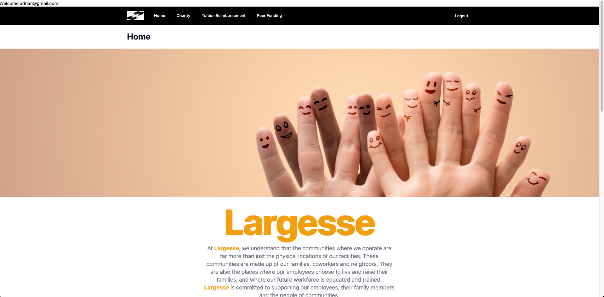

# Largesse

## Table of Contents
* [Introduction](#introduction) 
* [Contributors](#contributors)
* [Demo Images](#demo-images)
* [Links](#links)

## Introduction
We are building an application that connects employees of the company to charities that company partners with option to also choose their own charity to donate money and time to. The app also offers peer-to-peer assistance (medical assistance, disaster help). This will help the company improve upon employee engagement and employee retention.

## Contributors
 Project manager:  
 [Vanh Tharavong](https://github.com/simplyvpthar)  

Front End:  
[Adrian Banda](https://github.com/banda-adrian)  
[Paul Jackson](https://github.com/)  
[Ridge Khan](https://github.com/Rkhan93)   

 Back End:   
[Marcus Ramirez](https://github.com/marcuspramirez)  
[Vanh Tharavong](https://github.com/simplyvpthar)   
[Ridge Khan](https://github.com/Rkhan93)   
[Serge Noumbet](https://github.com/sergebryan)  

## Demo Images
Welcome Page
 

Log In
  

Create Account
  

Home

Charity

Tuition Reimbursement

Peer Funding

## Links
[Github Repsitory](https://github.com/marcuspramirez/largesse-app)
